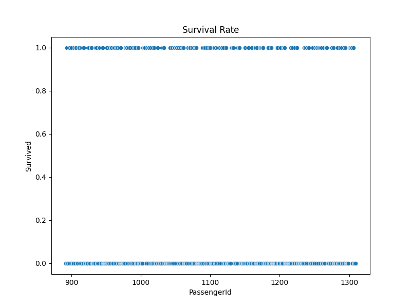
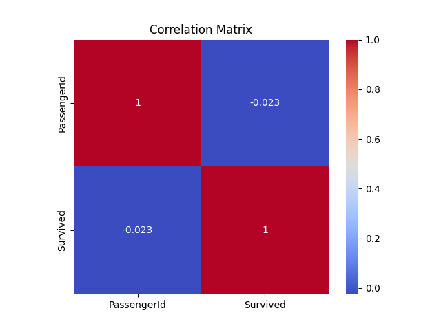
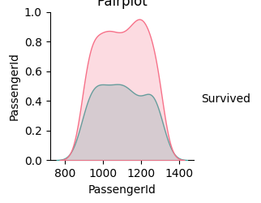
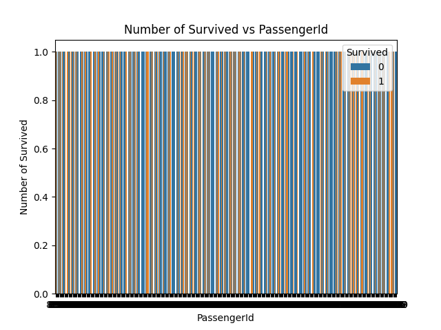

# Titanic EDA: Exploratory Data Analysis on Titanic Dataset

## Overview

This repository contains a Python class `TitanicEDA` that performs Exploratory Data Analysis (EDA) on the Titanic dataset. The class provides functions to visualize the survival rate of passengers and explore relationships between different variables using various plots.

## Features

- **Survival Rate Visualization:** Visualizes the survival rate of passengers using scatter plots.
- **Correlation Matrix:** Displays the correlation matrix using a heatmap to explore relationships between numerical variables.
- **Pairplot Analysis:** Provides a pairplot to visually inspect relationships between multiple variables with respect to survival.
- **Survival Count Plot:** Counts the number of survivors based on `PassengerId` and displays the results.

## Prerequisites

Before running the code, ensure that the following Python packages are installed:

- `pandas`
- `seaborn`
- `matplotlib`

You can install the required packages using `pip`:

```bash
pip install pandas seaborn matplotlib
```

## Usage

1. **Clone the Repository:**

   ```bash
   git clone https://github.com/Slayerma/PRODIGY_DS_02.git
   cd PRODIGY_DS_02
   ```

2. **Prepare the Dataset:**

   Make sure you have the Titanic dataset (e.g., `gender_submission.csv`) available in your working directory. You can download the dataset from [Kaggle](https://www.kaggle.com/competitions/titanic/data).

3. **Run the Analysis:**

   You can run the analysis by creating an instance of the `TitanicEDA` class and calling the `explore_data` method:

   ```python
   import pandas as pd
   import seaborn as sns
   import matplotlib.pyplot as plt

   # TitanicEDA class as provided

   titanic_eda = TitanicEDA('gender_submission.csv')
   titanic_eda.explore_data()
   ```

4. **Output:**

   The script will generate several plots:
   - **Survival Rate Scatter Plot:** Shows the survival status of passengers.
   
   - **Correlation Matrix Heatmap:** Displays the correlation between different numerical features.
   
   - **Pairplot:** Visualizes relationships between multiple features.

    
   - **Survival Count Plot:** Counts the number of survivors for different passengers.
   

## Files

- `Task_2.py`: The main Python script containing the `TitanicEDA` class and the analysis code.
- `README.md`: This file, providing an overview of the project and instructions on how to use it.

## Notes

- The class currently uses the `gender_submission.csv` dataset as a placeholder. You can replace this with any Titanic dataset that includes the required columns (`PassengerId`, `Survived`, etc.).
- The `_explore_relationships` method is a private method (denoted by the underscore `_`) and should not be called directly outside the class.

## Contributing

Feel free to contribute by submitting issues or pull requests. For major changes, please open an issue first to discuss what you would like to change.

